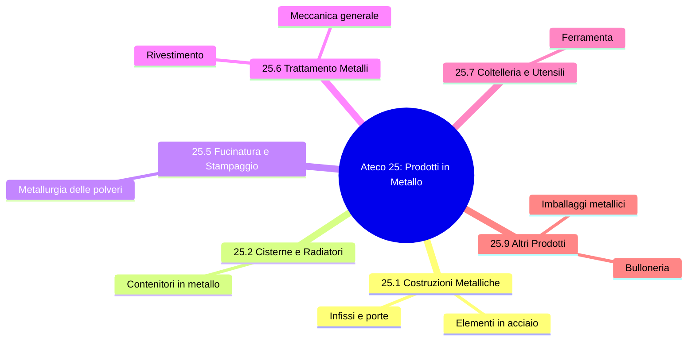
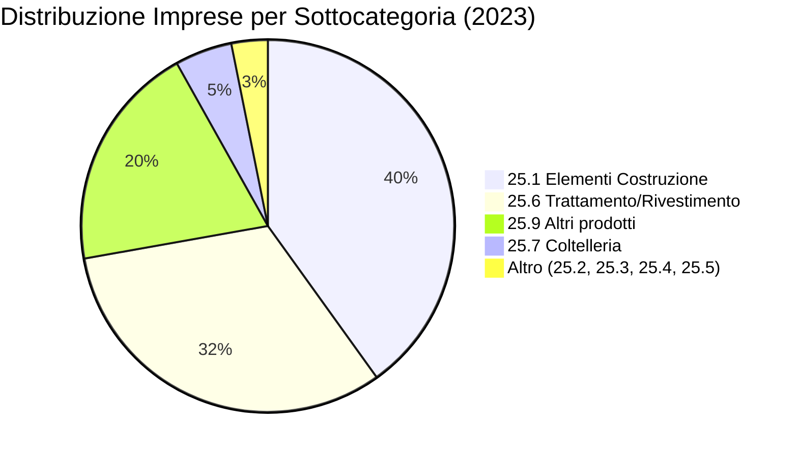

# Analisi del Settore ATECO 25: Fabbricazione di prodotti in metallo

## 1. Introduzione ed Executive Summary
Il presente documento analizza i dati strutturali relativi al settore **ATECO 25** (Fabbricazione di prodotti in metallo, esclusi macchinari e attrezzature) estratti dal database Istat (file `25.xlsx`).

Nel **2023**, il settore in Italia contava circa **69.264 imprese** attive, con un impiego complessivo di circa **610.790 addetti**. Si tratta di un comparto strategico dell'industria manifatturiera italiana, caratterizzato da una forte presenza di piccole e medie imprese (PMI) specializzate in lavorazioni meccaniche e produzione di elementi strutturali.

## 2. Struttura del Settore (Ateco 25)
Il settore è suddiviso in diverse sottocategorie. La mappa concettuale seguente illustra le principali aree di attività:

## 3. Distribuzione delle Imprese (Dati 2023)
Il comparto più rilevante numericamente è quello degli **elementi da costruzione (25.1)**, seguito dal **trattamento e rivestimento dei metalli (25.6)**.

### Distribuzione per Sottocategoria:
| Codice | Descrizione | Imprese (2023) |
| :--- | :--- | :--- |
| **25.1** | Fabbricazione di elementi da costruzione | 27.773 |
| **25.2** | Cisterne, serbatoi e radiatori | 520 |
| **25.3** | Generatori di vapore | 84 |
| **25.4** | Armi e munizioni | 113 |
| **25.5** | Fucinatura, stampaggio e profilatura | 1.465 |
| **25.6** | Trattamento e rivestimento dei metalli | 22.232 |
| **25.7** | Coltelleria e utensileria | 3.434 |
| **25.9** | Altri prodotti in metallo | 13.643 |
| **TOTALE**| | **69.264** |

## 4. Trend Storico e Occupazione
L'andamento dell'occupazione ha mostrato una notevole resilienza. Nonostante una riduzione del numero di unità locali in alcuni periodi (spesso dovuta a consolidamenti), il numero di addetti ha segnato una crescita costante negli ultimi anni.

### Indicatori Totali (Evoluzione):
- **2005**: 84.200 imprese | 628.059 addetti
- **2015**: 63.185 imprese | 498.621 addetti
- **2023**: 69.264 imprese | 610.790 addetti

> **Nota Metodologica**: A partire dal 2019, l'Istat ha adottato una nuova definizione di "impresa" (EU Reg. 696/93), che tiene conto delle relazioni nei gruppi societari. Questo ha causato una rottura nelle serie storiche, rendendo i dati pre-2019 non pienamente confrontabili con i successivi.

## 5. Analisi e Prospettive 2024
Dalla ricerca online emerge che il settore Ateco 25 sta affrontando diverse sfide:
1.  **Transizione Energetica e Digitale**: Le PMI del settore stanno investendo pesantemente in tecnologie 4.0 per migliorare l'efficienza dei processi termici e galvanici.
2.  **Costi delle Materie Prime**: La volatilità dei prezzi dell'acciaio e dell'alluminio continua a influenzare i margini operativi.
3.  **Export**: Il settore è fortemente orientato all'esportazione, con la Germania come partner principale; il rallentamento dell'economia tedesca nel 2024 ha generato segnali di incertezza negli ordinativi.

## Conclusioni
Il settore metalmeccanico "leggero" (Ateco 25) si conferma il cuore pulsante dell'industria italiana. Sebbene il numero di imprese sia inferiore rispetto ai picchi di metà anni 2000, l'attuale configurazione (con circa 610.000 addetti) indica un rafforzamento della dimensione media e della produttività delle aziende superstiti.
